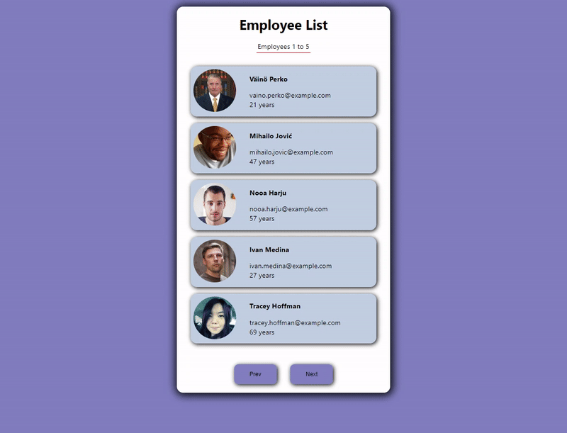

# employee-list

## Table of contents

- [Overview](#overview)
  - [Description](#description)
  - [Project Skeleton](#project-skeleton)
  - [Screenshot](#screenshot)
  - [Links](#links)
- [My process](#my-process)
  - [Built with](#built-with)


## Overview

### Description

The project is the application that lists the information of the company employees.

### Project Skeleton

```
language-card (folder)
       public(folder)
           |----index.html 
       src (folder)
           |----app.js 
           |----app.css
           |----index.js
           |----index.css 
           components (folder)
                button (folder)
                    |----Button.jsx
                    |----Button.css 
                header (folder)
                    |----Header.jsx
                    |----Header.css  
            helper (folder)
                 |----data.js
```

### Screenshot

<p align="center">
<a href="https://sezginakgul.github.io/employee-list/"></a>
</p>


### Links

- Live: [Live Website](https://sezginakgul.github.io/employee-list/)


### Built with

- REACT
- JAVASCRİPT
- HTML5
- CSS3

